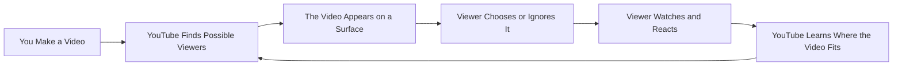
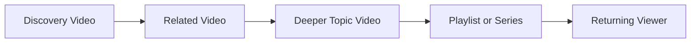

# How YouTube Finds Viewers for Your Videos

You do not need to become a machine-learning engineer to understand YouTube recommendations.

The useful creator question is simpler:

**How does YouTube decide which viewers might want my video, and what can I do with that knowledge?**

YouTube's current creator guidance describes Search and Discovery as systems that try to match each viewer with videos they are likely to watch and enjoy. Recommendations are personalized, and the same video can perform very differently with different audiences, on different surfaces, and at different times.

> **Creator principle:** The algorithm is not an audience you have to impress. It is a collection of systems trying to predict which viewers may want which videos.

This guide focuses on the parts creators can actually use: audience fit, topic choice, packaging, discovery surfaces, retention, satisfaction, catalog relationships, and diagnosis inside ViewTube.

---

## The Creator Mental Model

A useful way to think about a video's journey is:

This process is not a single one-time test. It can continue for hours, days, months, or years as YouTube finds new viewing contexts and the topic itself changes in popularity.

### Five ideas to remember

| Idea | What it means for a creator |
|---|---|
| Recommendations are personalized | Your video does not have one universal rank for everyone |
| Different surfaces behave differently | Home, Suggested, Search and Shorts should not be judged as if they are the same system |
| Performance is contextual | CTR, retention and watch time only make sense when you know who saw the video and where |
| Audience fit matters | A strong video for the wrong viewers can look weak |
| Satisfaction matters beyond the click | Packaging earns the opportunity; the video has to deliver on the promise |

> **Use this in ViewTube:** When a video underperforms, do not start with “the algorithm hated it.” Start by asking: **Who saw it, where did they see it, did they choose it, and what happened after they chose it?**

---

## What the Algorithm Is Actually Trying to Do

YouTube's public creator guidance says its discovery systems try to help viewers find videos they are likely to watch and enjoy, with the broader goal of long-term viewer satisfaction.

That means YouTube is not simply trying to reward:

- the channel with the most subscribers;
- the video with the highest raw CTR;
- the video with the longest watch time;
- the creator who uploads most often;
- the newest video;
- the most monetized video.

Instead, the system uses many signals to estimate which videos make sense for a particular viewer and context.

### Personalization signals YouTube publicly discusses

Examples include:

- watch history;
- search history;
- subscriptions;
- likes and dislikes;
- “Not interested” feedback;
- what a viewer does and does not watch;
- current viewing context;
- topic interest;
- competition;
- seasonality.

You do not control most of those signals directly. Your job is to make videos that create a clear and satisfying match between **topic + promise + audience + experience**.

### A better creator goal

Instead of asking:

> “How do I please the algorithm?”

Ask:

> “What kind of viewer is this for, why would they choose it now, and will the video satisfy the reason they clicked?”

That question is useful before publishing and useful again when analyzing performance.

---

## How a New Video Finds an Audience

A new upload does not need to “beat YouTube.” It needs opportunities with viewers who could plausibly want it.

YouTube may encounter potential viewers through several routes:

- viewers who already watch your channel;
- viewers who watch similar topics;
- viewers watching related videos right now;
- viewers searching for the subject;
- viewers whose recent behavior suggests interest;
- viewers entering the Shorts Feed;
- viewers coming through playlists, channel pages, notifications, end screens or external links.

The audience can widen, narrow, change, or reappear later.

### What creators often misread

A video can have good early numbers and still stop expanding because:

- the topic has a limited audience;
- stronger competing videos are available to the same viewers;
- the initial audience was especially warm;
- the packaging works for existing viewers but not broader viewers;
- the video performs well on Search but is not a strong Home candidate;
- the topic is seasonal;
- interest drops.

A video can also start slowly and later grow because:

- Search demand rises;
- another related video sends Suggested traffic;
- the topic becomes timely;
- a future upload creates a new catalog relationship;
- YouTube finds a better viewer group for it.

> **Do not conclude:** A slow first day does not prove a video is permanently dead, and a fast first hour does not guarantee long-term scale.

---

## Where Viewers Can Find Your Video

The most important discovery lesson is that **YouTube is not one traffic source**.

### Home / Browse

Home is heavily personalized. A viewer opens YouTube and sees a mix of recommendations based on their interests, history, context and current options.

**Creator focus:**

- strong topic appeal;
- instantly understandable packaging;
- a promise that makes sense without prior context;
- satisfying delivery;
- a catalog that helps YouTube understand what kinds of viewers repeatedly enjoy your work.

**Useful ViewTube questions:**

- Is Home/Browse actually giving this video impressions?
- Does CTR change as Home distribution expands?
- Are new viewers responding differently from returning viewers?
- Which prior videos share the same audience?

### Suggested / Up Next

Suggested appears around the current watch experience. The question is often:

**What should this viewer watch next?**

**Creator focus:**

- strong relationships between videos;
- clear series or topic continuity;
- follow-up videos;
- end screens and playlists;
- catalog depth;
- satisfying videos that make another video from you a logical next step.

**Useful ViewTube questions:**

- Which videos are sending Suggested traffic?
- Which of my own videos naturally pair together?
- Where are viewers leaving instead of continuing?
- Do I have a missing sequel, follow-up or bridge video?

### Search

Search starts with explicit viewer intent.

**Creator focus:**

- answer a real query or need;
- make title/topic language understandable;
- deliver the promised answer;
- avoid stuffing metadata with irrelevant phrases;
- build evergreen coverage where appropriate.

A search-driven video may behave very differently from a Home-driven entertainment video. That is not a problem; it is a different discovery job.

### Shorts Feed

Shorts creates rapid, personalized viewing decisions in a swipe-based environment.

**Creator focus:**

- immediate clarity;
- strong opening;
- fast value or intrigue;
- pacing appropriate to vertical short-form;
- rewatchability where natural;
- matching the content to the people being reached.

Do not apply long-form CTR logic directly to Shorts Feed behavior.

### Subscriptions and Notifications

These surfaces involve people who have already formed some connection with the channel.

They are useful, but subscribers are not a guaranteed view pool. Many subscribers do not watch every upload, and active audience size can differ substantially from subscriber count.

### Playlists, Channel Pages and End Screens

These surfaces help the creator intentionally shape the journey between videos.

They are especially useful for:

- series;
- courses;
- historical sequences;
- topic clusters;
- multi-part investigations;
- bingeable catalogs.

### External

External traffic can be valuable. It does not automatically “confuse the algorithm.”

What matters is what those viewers actually do and whether they are representative of the audience you want.

---

## Packaging Earns the Opportunity

Before somebody can watch your video, they usually have to notice and choose it.

That makes packaging important:

- topic;
- title;
- thumbnail;
- framing;
- promise.

CTR is one measurement of that choice on surfaces where counted impressions exist, but CTR is not a universal quality score.

### Why CTR changes

CTR can move because:

- the thumbnail/title changed;
- the audience changed;
- the traffic source changed;
- YouTube expanded distribution to colder viewers;
- competition changed;
- the topic became more or less relevant;
- returning viewers and new viewers responded differently.

A declining CTR during audience expansion can be normal. A high CTR on a tiny warm audience can be less impressive than a lower CTR at much larger scale.

### Packaging diagnosis

| Pattern | Possible interpretation | What to inspect next |
|---|---|---|
| High impressions + weak CTR | People see it but are not choosing it | Thumbnail, title, topic framing, audience fit |
| Low impressions + strong CTR | Small audience may like it, but scale/context is unclear | Traffic source, topic size, competition, audience expansion |
| Strong CTR + weak early retention | Packaging may promise more than the opening delivers | Hook, first minute, expectation match |
| CTR falls while views accelerate | Distribution may be broadening | Traffic-source and audience mix |
| CTR differs sharply by source | Packaging fits some contexts better than others | Home vs Search vs Suggested comparisons |

> **Use this in ViewTube:** Open Packaging Intelligence or Thumbnail Studio when the evidence points to a choice problem. Do not redesign the thumbnail simply because total views are low.

---

## What Happens After the Click

The click gets a viewer into the video. The experience determines whether the promise was worth it.

Useful creator evidence includes:

- watch time;
- average view duration;
- average percentage viewed;
- audience retention;
- likes and dislikes;
- shares;
- subscriptions;
- comments;
- explicit feedback;
- whether viewers continue watching.

No single public metric tells you the entire recommendation outcome.

### The first moments

Early abandonment can indicate:

- the intro is slow;
- the video starts somewhere different from the title/thumbnail promise;
- context takes too long;
- the viewer immediately realizes the video is not for them;
- the traffic source brought mismatched viewers.

But do not use a universal internet threshold as law. Compare against:

- your own similar videos;
- videos of similar length;
- the same format;
- the same traffic source where possible.

### The middle and ending

Retention dips can expose:

- repetitive sections;
- confusing explanations;
- slow pacing;
- unnecessary setup;
- weak transitions;
- moments viewers skip.

Spikes can indicate:

- rewatches;
- highly valuable moments;
- viewers jumping to a section;
- moments worth reusing in Shorts or future hooks.

---

## Satisfaction Is Bigger Than Retention

YouTube has repeatedly described recommendation goals in terms broader than raw watch time.

A viewer can:

- watch for a long time and still dislike the experience;
- finish a short video and be delighted;
- click because of curiosity and feel misled;
- leave early because they found the exact answer they needed quickly.

That is why creators should avoid reducing the algorithm to one number.

### A healthier hierarchy

Think in this order:

1. **Right viewer**
2. **Clear choice**
3. **Promise kept**
4. **Useful or enjoyable experience**
5. **Desire to continue watching or return**

The analytics are evidence about these stages, not a videogame score.

---

## Topic, Audience and Competition

YouTube's current creator guidance explicitly highlights topic interest, competition and seasonality as external factors.

This matters because creators often interpret every distribution change as something they personally did wrong.

### Topic interest

Some subjects simply have larger potential audiences than others.

A brilliant video about a tiny subject may never receive the raw reach of an average video about a huge current event. That does not make the smaller video unsuccessful.

### Competition

Your video does not compete only with your own previous uploads. For a given viewer, it competes with other videos that viewer might reasonably choose.

This is one reason a video can have good channel-relative metrics and still receive fewer impressions.

### Seasonality

Interest changes with:

- holidays;
- school/work cycles;
- sports/events;
- elections/news;
- product launches;
- anniversaries;
- cultural moments.

Use ViewTube comparisons and historical windows before concluding that a channel-level decline is caused by content quality.

---

## Subscribers Are Not the Audience

Subscriber count is useful, but it is not the same as active audience.

A viewer can subscribe and stop watching. A non-subscriber can watch every upload.

Better questions include:

- How many unique people are actually watching?
- How many are returning?
- Which videos bring new viewers?
- Which videos deepen repeat viewing?
- Which topics make people explore the catalog?

> **Use this in ViewTube:** Pair subscriber metrics with unique viewers, new/returning audience behavior and catalog pathways rather than treating subscriber count as guaranteed distribution.

---

## Why Some Videos Keep Growing

Long-tail growth can come from several mechanisms:

- Search demand;
- recurring seasonal interest;
- Suggested relationships;
- a growing topic;
- external discovery;
- playlists;
- future uploads that revive the subject;
- a deep catalog that keeps producing related entry points.

This is why old videos should not automatically be treated as finished.

### Catalog thinking

A channel with one isolated video gives YouTube and viewers fewer next-step options.

A connected catalog can create:

ViewTube should help you see those relationships rather than only score uploads independently.

---

## Why a Video Can Stop Growing

A slowdown can have many explanations:

- the reachable interested audience has been partly exhausted;
- topic demand fell;
- competing options improved;
- initial warm viewers responded better than broader viewers;
- packaging weakened as the audience widened;
- Suggested relationships changed;
- the event/news cycle ended;
- the video no longer fits the current viewer context.

A slowdown is a diagnosis problem, not proof of punishment.

### Before changing anything

- [ ] Check traffic sources.
- [ ] Check whether impressions actually fell.
- [ ] Compare CTR by source, not only channel-wide.
- [ ] Compare retention with similar videos.
- [ ] Check whether the topic itself changed.
- [ ] Check new versus returning viewer behavior.
- [ ] Review title/thumbnail history.
- [ ] Check whether another video can create a stronger catalog bridge.

---

## Common Algorithm Myths

### “YouTube gives every video a fixed test audience”

YouTube does not publish a universal fixed number of test impressions for every upload.

Creators may observe phases of distribution, but those observations should not be turned into a platform rule.

### “One bad video damages the whole channel”

A weak upload can teach you something about audience fit, but YouTube does not describe one bad video as a permanent channel penalty.

### “Taking a break permanently hurts the channel”

A break may affect audience habits and momentum, but creator guidance does not describe a permanent algorithmic punishment for taking time off.

### “Tags are the main ranking lever”

Tags can provide metadata context, but they are not a substitute for topic relevance, packaging, viewer response and satisfaction.

### “External traffic confuses the algorithm”

External viewers are another source of viewers. Judge the quality and behavior of that traffic instead of assuming the source itself is harmful.

### “There is one CTR or retention number I must hit”

YouTube does not publish one universal threshold that guarantees recommendations.

Benchmarks should be contextual.

---

## Diagnose a Video in ViewTube

This is the practical workflow the resource should lead you toward.

### Step 1 — Is the video being shown?

Inspect:

- impressions;
- Shorts shown-in-feed where relevant;
- traffic sources;
- changes over time.

If exposure is limited, do not immediately assume the thumbnail is the problem.

### Step 2 — Are the right viewers choosing it?

Inspect:

- CTR where impressions apply;
- chose-to-view behavior for Shorts;
- differences by traffic source;
- new versus returning audience response.

If people see it but do not choose it, investigate the package and topic framing.

### Step 3 — Does the opening keep the promise?

Inspect:

- first 30–60 seconds for long-form;
- first moments for Shorts;
- early retention curve;
- obvious drop points.

If the click is strong but early viewing is weak, the issue may be promise delivery.

### Step 4 — Does the rest of the video stay useful or enjoyable?

Inspect:

- retention curve;
- average view duration;
- average percentage viewed;
- spikes and dips;
- comments and feedback.

### Step 5 — Does the video create a next step?

Inspect:

- Suggested relationships;
- end screens;
- playlists;
- channel-page pathways;
- related videos;
- repeat viewers.

### Step 6 — Is the topic itself limiting scale?

Inspect:

- search behavior;
- channel baselines;
- similar topics;
- seasonality;
- competition;
- opportunity intelligence.

### ViewTube action map

| What you observe | Open in ViewTube | Useful next question |
|---|---|---|
| Weak choice rate | Packaging Intelligence / Thumbnail Studio | Is the promise clear and compelling for this audience? |
| Strong click, weak opening | Content Analysis / Retention tools | Where does the promise break? |
| Search works, Home does not | Traffic Sources / Discovery analysis | Is this an intent-driven video rather than broad Home content? |
| Good video, tiny reach | Opportunity Intelligence / Audience analysis | Is the topic small, seasonal or highly competitive? |
| One successful video with no follow-up | Projects / Idea systems | What should this viewer watch next? |
| Returning viewers like it, new viewers do not | Audience analysis | Does the packaging require too much channel context? |
| Shorts audience does not cross to long-form | Shorts + catalog pathway analysis | Is there a clear thematic bridge? |

> **Ask the Brain:** “Explain this video's distribution using traffic source, audience type, packaging response and retention. Separate evidence from guesses and tell me what to test next.”

---

## Pre-Publish Creator Checklist

- [ ] I can describe the intended viewer in one sentence.
- [ ] The topic solves a clear interest, question, curiosity or entertainment need.
- [ ] The title and thumbnail communicate one coherent promise.
- [ ] The opening begins fulfilling that promise quickly.
- [ ] The structure removes unnecessary delay.
- [ ] The video has a logical next video, playlist or channel pathway.
- [ ] I know which discovery surfaces are most plausible.
- [ ] I am not relying on tags or upload frequency as my main strategy.
- [ ] I have a plan for reviewing the correct metrics after publishing.

---

## Post-Publish Creator Checklist

- [ ] Identify the dominant traffic sources.
- [ ] Compare impressions and choice behavior together.
- [ ] Inspect early retention before changing packaging blindly.
- [ ] Compare the video with similar videos, not every upload.
- [ ] Check new versus returning viewer behavior.
- [ ] Review whether distribution is broadening or narrowing.
- [ ] Note any strong Suggested or playlist relationships.
- [ ] Record the hypothesis before making a title/thumbnail change.
- [ ] Measure the result of any change instead of relying on memory.

---

## Advanced Reference: What the Technical Research Adds

Creators do not need this section to use the guide, but it explains why the simple mental model is reasonable.

Historical YouTube engineering research described a large-scale recommendation architecture with two broad stages:

1. **candidate generation** — narrow an enormous catalog to plausible videos for a viewer/context;
2. **ranking** — evaluate those candidates with richer features and order them.

Later research described multi-task ranking approaches that model several viewer outcomes rather than one single click score.

These papers are valuable architectural evidence, but they are **not a public blueprint of the exact 2026 production system**.

### What YouTube does not publish

YouTube does not publicly provide:

- exact current signal weights;
- one universal recommendation score;
- fixed retention thresholds;
- fixed impression-test sizes;
- exact current model hyperparameters;
- a guaranteed formula for Home, Suggested or Shorts distribution.

If an online post claims those values with certainty, treat it cautiously unless YouTube has published them directly.

---

## Quick Reference

| Creator question | Best first evidence |
|---|---|
| Why is nobody seeing this? | Impressions / shown-in-feed + traffic source |
| Why are people not clicking? | CTR by surface + packaging |
| Why do they leave quickly? | Early retention + expectation match |
| Why did views suddenly rise? | Views by day + traffic source |
| Why did CTR fall while views rose? | Audience/traffic expansion |
| Why does Search work but Home not? | Surface intent differences |
| Why are subscribers not watching? | Unique/returning viewers + subscription traffic |
| Why did an old video revive? | Traffic source + related videos + search/topic trend |
| Should I change the thumbnail? | Packaging evidence, not raw view count alone |
| What should I make next? | Audience overlap + Suggested pathways + opportunity evidence |

---

## Glossary

**Algorithm** — A broad creator shorthand for the systems YouTube uses to search, rank, recommend and organize content. There is not one single public “algorithm score.”

**Recommendation** — A video surfaced to a viewer based on predicted relevance, interest and satisfaction.

**Personalization** — Adjusting what appears based on the viewer's behavior and context.

**Home / Browse** — Personalized discovery surfaces that include the YouTube homepage.

**Suggested / Up Next** — Recommendations connected to the current watch experience.

**Search** — Discovery initiated by an explicit query.

**Traffic source** — The path through which a view arrived.

**Impression** — A counted display of a thumbnail on eligible YouTube surfaces.

**CTR** — The percentage of counted impressions that became views.

**Retention** — Evidence describing how viewing continues across a video.

**AVD** — Average View Duration.

**APV** — Average Percentage Viewed.

**Satisfaction** — A broader concept than raw watch time, informed by behavior and explicit/implicit feedback.

**Audience fit** — How well a video's topic, promise and experience match the viewers seeing it.

---

## Related ViewTube Resources

- How to Read YouTube Analytics
- Shorts vs Long-Form: Different Systems, Different Signals
- Traffic Sources and Discovery Pathways
- Audience Retention and Watch Behavior
- Thumbnail and Title Packaging Handbook
- Reading Analytics Correctly

---

## Sources and Further Reading

### Current official creator guidance

**YouTube Help — Search & discovery tips**  
Current creator-facing explanation of personalization, performance, topic interest, competition and seasonality.  
https://support.google.com/youtube/answer/11914225

**YouTube Help — YouTube performance FAQ & Troubleshooting**  
Official creator guidance explaining that discovery systems find videos for viewers rather than simply “promoting a channel.”  
https://support.google.com/youtube/answer/141805

**YouTube Help — How YouTube recommendations work**  
Current overview of recommendation surfaces and personalization signals.  
https://support.google.com/youtube/answer/16089387

**YouTube Help — Good to know about recommendations**  
Current explanation of context, devices, active audience and catalog effects.  
https://support.google.com/youtube/answer/16559651

**YouTube Help — External factors for recommendations**  
Official explanation of topic interest, competition and seasonality.  
https://support.google.com/youtube/answer/16558238

**YouTube Blog — On YouTube's Recommendation System**  
Official background on satisfaction and recommendation goals.  
https://blog.youtube/inside-youtube/on-youtubes-recommendation-system/

### Advanced technical background

**Deep Neural Networks for YouTube Recommendations** — Covington, Adams & Sargin, RecSys 2016. Historical architecture evidence for candidate generation and ranking.  
https://research.google.com/pubs/archive/45530.pdf

**Recommending What Video to Watch Next: A Multitask Ranking System** — Zhao et al., 2019. Historical/technical research on multi-task ranking.  
https://dl.acm.org/doi/10.1145/3298689.3346997

---

## Document Maintenance

| Attribute | Value |
|---|---|
| Document version | 2.0 |
| Resource classification | Creator Education / Recommendations |
| Research checked | 2026-09-26 |
| Primary audience | Everyday YouTube creators |
| Technical depth | Creator-first with optional advanced reference |
| Review cadence | Semi-annual or after major Search/Discovery guidance changes |

### Maintenance Checklist

- [ ] Recheck official Search & Discovery guidance.
- [ ] Recheck recommendation surfaces and terminology.
- [ ] Recheck current guidance on topic interest, competition and seasonality.
- [ ] Verify Shorts discovery terminology.
- [ ] Keep technical architecture in the advanced section rather than the creator learning path.
- [ ] Remove any universal thresholds that are not officially documented.
- [ ] Preserve stable resource ID and links.
