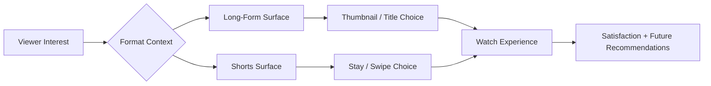
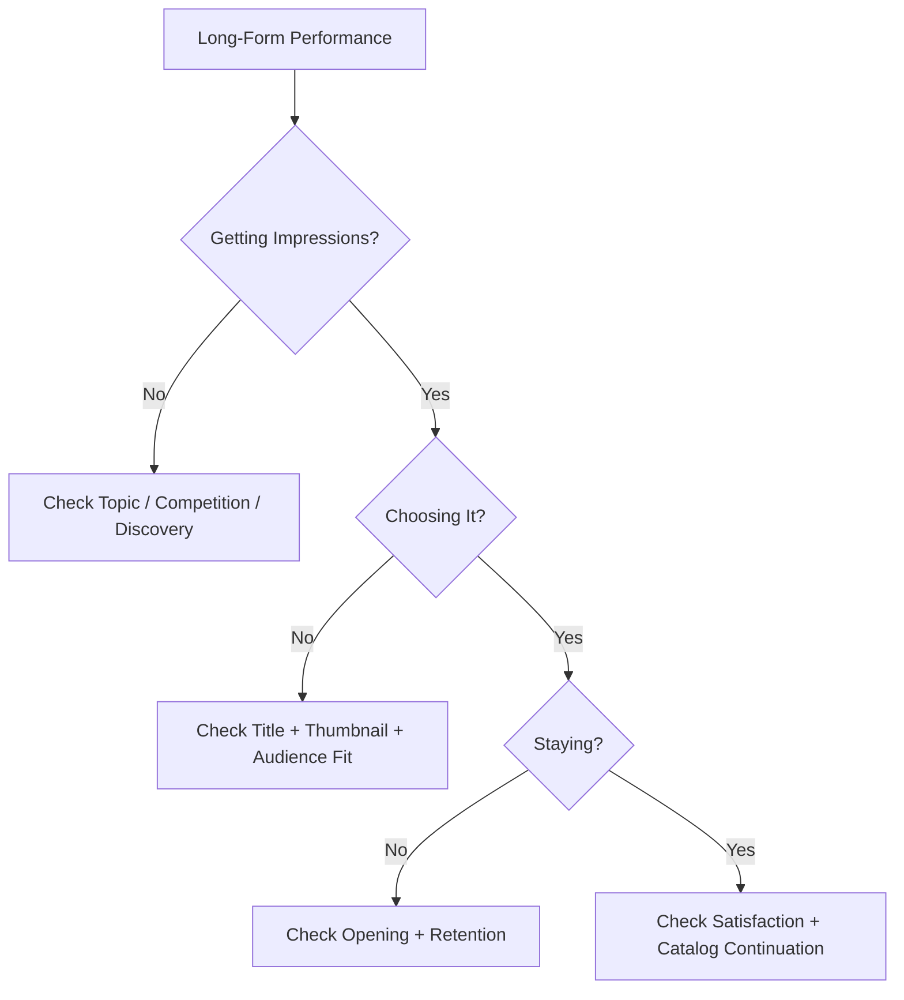
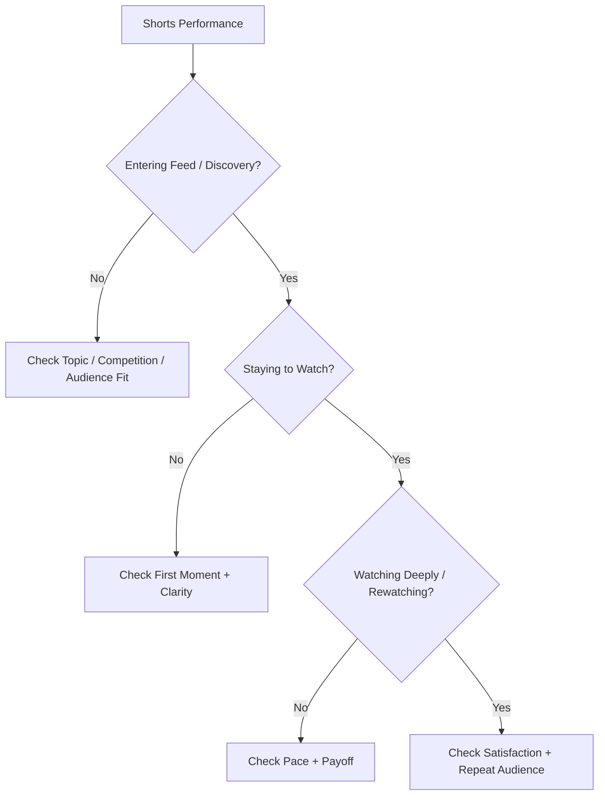

# Shorts vs Long-Form: Different Systems, Different Signals

Shorts and long-form videos live on the same YouTube platform, but viewers often encounter, choose, watch, and leave them in very different ways.

That means creators should not judge them with one universal scoreboard.

YouTube's current guidance says the recommendation goal is consistent across formats: understand whether a viewer is likely to be interested and satisfied. But the signals used to understand performance vary by format, and viewers themselves often have different preferences for Shorts, long videos, live streams, and posts.

> **Creator principle:** Do not ask whether Shorts or long-form is "better." Ask what job each format is doing for your audience, what evidence fits that viewing experience, and whether the format supports your channel strategy.

This guide teaches how to compare the formats without mixing incompatible metrics, how to diagnose each one in ViewTube, and how to use Shorts and long-form together without assuming one automatically helps or hurts the other.

---

## Same Goal, Different Viewing Experience

Both formats compete for viewer attention, but the viewing situation can be radically different.

A long-form viewer may:

- see a thumbnail on Home;
- read a title;
- decide whether the topic deserves several minutes or more;
- watch on a phone, desktop, tablet, or television;
- continue into another video.

A Shorts viewer may:

- enter a personalized vertical feed;
- see the video begin almost immediately;
- decide within moments whether to stay or swipe;
- watch several different creators in rapid succession;
- replay a Short without making a traditional thumbnail-click decision.

### Creator comparison

| Question | Long-form | Shorts |
|---|---|---|
| How is the video often encountered? | Home, Suggested, Search, subscriptions, playlists, channel pages | Shorts Feed, Home, Search, subscriptions, sounds/hashtags, channel pages |
| Is a thumbnail click always the key choice? | Often important on impression-based surfaces | Not in the Shorts Feed; staying vs swiping is more central |
| Typical commitment | Usually higher | Usually lower at the moment of discovery |
| Useful watch evidence | Watch time, AVD, APV, retention curve | Stayed to watch, engaged views, AVD, APV, repeat behavior |
| Common creator job | Depth, explanation, story, session continuation | Fast discovery, compact value, hooks, ideas, repeat exposure |
| Best comparison baseline | Similar long-form videos | Similar Shorts |

### Simple format flow

The final goal is similar. The route to that goal is not.

> **Use this in ViewTube:** Always set the format before interpreting performance. A metric without format context can create a false diagnosis.

---

## One Recommendation Goal, Format-Specific Signals

YouTube currently describes content performance using three broad buckets:

1. **Appeal** — did viewers choose the content or ignore it?
2. **Engagement** — once viewing began, did they stay?
3. **Satisfaction** — did they enjoy the experience?

Those ideas apply across formats, but the evidence can look different.

### Appeal

For long-form, appeal may be reflected by:

- thumbnail impressions;
- impressions CTR;
- views from Home or Suggested;
- Search choice;
- title/thumbnail response.

For Shorts Feed discovery, appeal may be reflected by:

- whether viewers stay to watch;
- whether they swipe away;
- how often the Short earns engaged viewing.

### Engagement

For long-form:

- average view duration;
- average percentage viewed;
- retention curve;
- watch time;
- key moments.

For Shorts:

- engaged views;
- average view duration;
- average percentage viewed;
- stayed to watch;
- replay/loop behavior where relevant.

### Satisfaction

Across formats, useful signals can include:

- likes;
- dislikes;
- "Not interested";
- survey feedback;
- shares;
- comments;
- subsequent viewing;
- returning behavior.

> **Do not conclude:** There is not one public Shorts score and one public long-form score that creators can calculate. YouTube does not publish exact ranking weights.

---

## What Counts as a View in 2026

This changed recently and matters when comparing formats.

Beginning **August 24, 2026**, YouTube says views are counted when a video starts to play across formats, including:

- Shorts;
- long-form VOD;
- live streams.

That creates a more consistent top-level view count, but it does **not** make every deeper metric equivalent.

### Why engaged viewing still matters

YouTube continues to surface **engaged views** and engagement-based watch metrics to help creators distinguish a playback start from a viewer who stayed.

For Shorts in particular, engaged-view measures remain important for deeper performance analysis and YouTube Partner Program calculations.

### Creator interpretation

| Number | Useful meaning | Do not assume |
|---|---|---|
| Views | Playback starts under the current YouTube definition | Every view represents equal attention |
| Engaged views | Viewer stayed beyond the initial viewing threshold/context | It is the only important Shorts metric |
| Watch time | Total viewing time | More watch time always means better audience fit |
| AVD | Average viewing duration among the applicable viewing base | AVD is directly comparable across radically different lengths |
| APV | Average percentage viewed | The same APV target should apply to every format |

### Comparing across the 2026 change

If you analyze historical performance spanning the August 24, 2026 view-definition change:

- mark the change date;
- avoid assuming before/after raw views are perfectly comparable;
- use engaged-view and watch behavior where available;
- compare like-for-like periods carefully.

> **Use this in ViewTube:** ViewTube should display metric-definition change markers when a comparison crosses a major YouTube counting change.

---

## Packaging Works Differently

Long-form packaging usually has more time and space to make a promise.

Shorts packaging still matters, but the Shorts Feed itself can begin playing content before the viewer makes a classic thumbnail-click choice.

### Long-form packaging

Usually prioritize:

- video idea;
- thumbnail;
- title;
- promise;
- clear audience relevance.

A strong long-form package answers:

**Why should I spend meaningful time on this video?**

### Shorts packaging

Prioritize:

- first visible moment;
- opening line;
- immediate subject clarity;
- motion/composition;
- title/context where surfaced;
- a reason not to swipe.

A strong Shorts opening answers:

**Why should I keep watching instead of moving to the next Short?**

### The promise still has to match

Both formats can fail when the opening does not fulfill the promise.

Long-form example:

- dramatic thumbnail;
- strong CTR;
- slow two-minute intro;
- steep early drop.

Shorts example:

- intriguing first frame;
- viewers stay initially;
- payoff is delayed too long;
- engagement collapses.

> **Use this in ViewTube:** Packaging Intelligence should evaluate long-form title/thumbnail response differently from Shorts feed-opening response rather than forcing one packaging score onto both formats.

---

## The Opening Matters in Both Formats

YouTube's current creator guidance emphasizes the initial seconds for both Shorts and long-form.

The difference is the viewer's switching cost.

In the Shorts Feed, leaving can require only a swipe.

In long-form, a viewer may have already:

- examined a thumbnail;
- read a title;
- clicked intentionally;
- made a larger time commitment.

### Shorts opening questions

- Does the first moment make sense without setup?
- Is the subject immediately visible or understandable?
- Is there a reason to stop scrolling?
- Does the Short deliver value quickly enough?
- Is the pace appropriate to the idea?

### Long-form opening questions

- Does the opening confirm the title/thumbnail promise?
- Is unnecessary setup delaying the value?
- Does the viewer understand the stakes?
- Is the first section strong enough to justify the longer commitment?
- Does the structure create forward momentum?

### Common mistake

Do not conclude:

> "My Short needs the same 30-second retention target as my 20-minute video."

Those are completely different viewing experiences.

---

## Retention Means Different Things by Format

Retention is useful for both formats, but comparison requires context.

### Long-form retention

Useful questions:

- Where does the first major drop happen?
- Does the intro lose viewers before the main value begins?
- Are there sections viewers skip?
- Are there spikes worth studying?
- Does the video sustain interest over several minutes?
- Where do viewers leave relative to structural transitions?

### Shorts retention

Useful questions:

- Did the viewer stay past the first moments?
- Does AVD approach or exceed the Short's duration because of rewatching?
- Does APV indicate strong completion or replay?
- Are viewers leaving before the payoff?
- Is the Short too slow for the feed context?

### Absolute vs relative watch time

YouTube's performance FAQ has historically advised creators to think about both absolute and relative watch time, with relative watch time often more informative for shorter videos and absolute watch time more informative for longer videos.

That is a **creator heuristic**, not a universal ranking formula.

### Fair retention comparison

| Compare | Good idea? |
|---|---|
| 30-second Short vs another 30-second Short | Yes |
| 20-minute documentary vs another similar documentary | Yes |
| 15-second Short vs 40-minute documentary using one APV target | No |
| Long-form first 30 seconds across similar videos | Useful |
| Shorts stayed-to-watch across similar Shorts | Useful |

---

## Discovery Surfaces Are Not the Same

A format can perform differently because the surface changes the viewer's intent.

### Long-form Home

Viewer state:

- browsing choices;
- comparing titles and thumbnails;
- potentially willing to invest significant time.

Useful evidence:

- impressions;
- CTR;
- watch behavior;
- new vs returning viewers;
- Browse traffic.

### Suggested / Up Next

Viewer state:

- already watching something;
- looking for a logical next step.

Useful evidence:

- referring videos;
- watch continuity;
- end screens;
- topic relationships;
- session pathways.

### Search

Can serve both Shorts and long-form.

Viewer state:

- explicit intent;
- problem/question/topic oriented.

Useful evidence:

- query terms;
- relevance;
- watch response;
- format preference for that query.

### Shorts Feed

Viewer state:

- rapid personalized discovery;
- low-friction switching;
- repeated feed consumption.

Useful evidence:

- stayed to watch;
- swiped away;
- engaged views;
- AVD;
- APV;
- likes/satisfaction;
- repeat audience behavior.

### Cross-format discovery

YouTube says viewer interests can inform recommendations across Shorts, long videos, live streams, and posts. A viewer who enjoys one format may therefore encounter another format from the same topic or channel.

But YouTube also notes that cross-format behavior is not guaranteed; viewers can prefer one format for a topic and ignore another.

That distinction is critical.

---

## Shorts Do Not Automatically Hurt Long-Form

YouTube's current Shorts discovery guidance explicitly says Shorts performance does not negatively impact long-form video recommendations.

YouTube also says experimenting with different formats does not inherently confuse the recommendation system.

### What can happen instead

A creator may observe:

- many Shorts subscribers who rarely watch long-form;
- long-form viewers who ignore Shorts;
- Shorts introducing new viewers who later watch long-form;
- long-form fans who also consume Shorts;
- two mostly separate audience groups on one channel.

Those patterns are about **viewer behavior**, not an automatic cross-format penalty.

### Better diagnosis

Instead of:

> "Shorts killed my long-form."

Ask:

- Did long-form impressions actually decline?
- Did long-form CTR change?
- Did returning long-form viewers decline?
- Are Shorts attracting a different topic audience?
- Are Shorts and long-form promises aligned?
- Do Shorts provide a natural bridge to deeper videos?
- Are the two formats serving different viewer needs?

> **Use this in ViewTube:** Cross-format audience overlap should be measured rather than assumed.

---

## Audience Overlap Is a Strategy Question

A channel can use Shorts and long-form in several valid ways.

### One audience, two depths

Example:

- Short: "Napoleon's biggest mistake in 30 seconds"
- Long-form: "Why Napoleon Lost the Russian Campaign"

The Short creates quick discovery.  
The long-form provides depth.

### One topic, different viewer preferences

Some people may love historical Shorts but never watch a 30-minute documentary.

That is not necessarily failure.

### Separate content pillars

A channel may use Shorts for one content pillar and long-form for another.

This can work, but ViewTube should help determine whether the audiences:

- overlap;
- remain separate;
- confuse the creator's strategic goals;
- produce useful cross-format pathways.

### The creator question

Do not ask:

> "Did Shorts viewers convert?"

Ask:

> "What percentage of the audience meaningfully crosses formats, which topics create the bridge, and is that amount strategically useful?"

---

## Subscribers Behave Differently From Active Viewers

Shorts can generate large subscriber bursts.

Long-form can also create subscribers, but often through a different level of time investment.

Neither format guarantees that new subscribers will watch the other format.

### Better subscriber analysis

Inspect:

- subscribers gained per video;
- new viewers;
- returning viewers;
- long-form views from subscribers;
- Shorts views from subscribers;
- cross-format repeat behavior.

### A useful warning

Subscriber count is not the same as:

- active long-form audience;
- active Shorts audience;
- returning audience;
- guaranteed impressions.

Treat subscriber growth as one outcome, not the final definition of channel health.

---

## Traffic Sources Need Format Context

A traffic-source chart can mean different things depending on format.

### Long-form example

A video might receive:

- 55% Browse;
- 25% Suggested;
- 10% Search;
- 5% Channel pages;
- 5% External.

The creator may focus on packaging and catalog relationships.

### Shorts example

A Short might receive most views from:

- Shorts Feed;
- Home;
- Search;
- channel pages;
- sound/hashtag surfaces.

The creator may focus more on feed appeal, opening response and topic fit.

### Do not flatten the sources

If ViewTube says:

> "Video A has more Search than Video B"

that is not enough.

It should say:

- format;
- share of total traffic;
- watch behavior from that source;
- audience type;
- whether the source is normal for that content.

---

## Revenue and Business Value Are Different

Shorts and long-form can create different business outcomes.

A creator may value a format for:

- direct ad revenue;
- subscriber growth;
- discovery;
- sponsorship visibility;
- catalog entry;
- product sales;
- memberships;
- deeper audience relationship.

Do not decide format strategy from raw view count alone.

### Creator value matrix

| Goal | Shorts can be strong for | Long-form can be strong for |
|---|---|---|
| Fast discovery | Rapid reach and topic sampling | Search/Home discovery with a larger commitment |
| Depth | Condensed point or teaser | Detailed explanation, story, tutorial |
| Catalog entry | Quick introduction to topic/channel | Strong next-video and binge pathways |
| Revenue | Can contribute at scale; uses Shorts monetization model | Often stronger per-view monetization potential depending on audience/content |
| Loyalty | Repeated lightweight contact | Longer time with creator and deeper sessions |
| Testing ideas | Fast concept feedback | Deeper validation of topic/promise |

This is strategic context, not a guarantee.

---

## When to Make a Short

A Short is often a strong fit when:

- the idea can deliver value quickly;
- one visual fact or moment can carry the video;
- the topic benefits from rapid discovery;
- you want to test interest in an angle;
- a long-form video contains a compelling standalone moment;
- the audience naturally consumes the subject in short form.

### Short checklist

- [ ] The first moment is understandable.
- [ ] The value/payoff is clear.
- [ ] The pacing fits the idea.
- [ ] The Short works even if the viewer has never seen the channel.
- [ ] The topic supports the channel strategy.
- [ ] If it points to long-form, the bridge is natural rather than forced.

---

## When to Make Long-Form

Long-form is often a strong fit when:

- the idea needs explanation or buildup;
- the story benefits from structure;
- viewers need context;
- depth is the value;
- the topic can support multiple chapters;
- the content can create a strong next-video relationship.

### Long-form checklist

- [ ] The topic justifies the time commitment.
- [ ] The thumbnail/title promise is clear.
- [ ] The opening validates the click quickly.
- [ ] The structure has meaningful progression.
- [ ] Filler has been removed.
- [ ] The video has a logical next step in the catalog.

---

## Use Shorts to Support Long-Form Intentionally

Cross-format strategy works best when the connection is useful to the viewer.

### Strong bridge patterns

**Preview**
- Show a compelling result or moment.
- Long-form explains how/why.

**Question → answer**
- Short raises the interesting question.
- Long-form provides the complete answer.

**Single fact → complete story**
- Short delivers one memorable fact.
- Long-form gives context.

**Clip → source episode**
- Short uses a self-contained moment from a larger video.
- Long-form is the natural deeper experience.

**Series**
- Shorts introduce recurring subtopics.
- Long-form assembles or expands them.

### Weak bridge pattern

> "Watch my full video!" with no reason the Shorts viewer would want the longer experience.

Cross-format conversion is earned by topic and viewer interest, not by a link alone.

---

## Diagnose Shorts vs Long-Form in ViewTube

Use different first questions for each format.

### Long-form diagnosis flow

### Shorts diagnosis flow

### ViewTube action map

| Observation | Format | Open in ViewTube | Question |
|---|---|---|---|
| Impressions but weak CTR | Long-form | Packaging Intelligence / Thumbnail Studio | Is the promise clear and compelling? |
| Strong CTR, weak first minute | Long-form | Content Analysis / Retention | Does the opening deliver the promise? |
| Strong retention, weak reach | Long-form | Opportunity Intelligence / Traffic Sources | Is topic demand or competition limiting scale? |
| High Shorts views, low stayed-to-watch | Shorts | Shorts Analysis / Hook tools | Are viewers immediately swiping? |
| Good stayed-to-watch, weak APV | Shorts | Content Analysis | Is the middle/payoff too slow? |
| Strong Shorts, weak long-form crossover | Cross-format | Audience / Catalog Pathways | Are these actually the same viewers and topic need? |
| Strong long-form, weak Shorts | Cross-format | Format comparison | Does this audience prefer depth over feed viewing? |
| Subscriber spike without returning viewers | Either | Audience analysis | Did this create an active relationship or only a one-time action? |

> **Ask the Brain:** "Compare this Short and this long-form video using format-appropriate signals. Do not rank them on raw views alone. Explain appeal, engagement, satisfaction, audience overlap, traffic sources, and what each format is contributing to the channel."

---

## Compare Formats Without Lying to Yourself

A fair comparison starts by defining the goal.

### If the goal is discovery

Compare:

- new viewers;
- unique viewers;
- reach/exposure;
- traffic sources;
- subscriber acquisition;
- topic expansion.

### If the goal is depth

Compare:

- watch time;
- AVD;
- retention;
- repeat viewing;
- session/catalog continuation.

### If the goal is loyalty

Compare:

- returning viewers;
- repeat audience behavior;
- subscribers who continue watching;
- cross-video consumption.

### If the goal is revenue

Compare:

- estimated revenue;
- RPM where meaningful;
- monetization model;
- geography;
- format-specific earning mechanics;
- downstream business value.

### If the goal is creative testing

Compare:

- speed of feedback;
- comments;
- audience response;
- topic performance;
- follow-up success.

Do not select the metric after seeing which format "wins."

---

## A Practical Cross-Format Experiment

Suppose you have a long-form history video idea.

### Step 1 — Publish the long-form video

Track:

- impressions;
- CTR;
- first-minute retention;
- AVD/APV;
- Search/Browse/Suggested;
- new vs returning viewers.

### Step 2 — Create two Shorts from the same subject

Short A:
- surprising fact.

Short B:
- dramatic question.

Track:

- views;
- engaged views;
- stayed to watch;
- AVD/APV;
- subscribers;
- traffic sources.

### Step 3 — Measure the bridge

Inspect:

- long-form traffic after Shorts publish;
- new viewers who later watch the long video where measurable;
- subscriber/returning-viewer behavior;
- comments indicating crossover;
- related-video or channel-pathway changes.

### Step 4 — Record the lesson

Possible findings:

- topic works in both formats;
- Short A works but does not create long-form interest;
- Short B creates a stronger bridge;
- long-form audience prefers a different angle;
- Shorts attract a separate audience that is still valuable.

The result should become a channel-specific learning, not a universal rule.

---

## Myths About Shorts and Long-Form

### "Shorts ruin long-form recommendations"

YouTube says Shorts performance does not negatively impact long-form recommendations.

Viewer preferences can still create different audience patterns.

### "Shorts subscribers are useless"

Some Shorts subscribers may never watch long-form. Others may.

Measure the actual audience relationship.

### "Every Short should promote a long video"

No. A Short should first work as a satisfying Short.

A bridge is useful only when the deeper video matches the same viewer need.

### "Long-form is always more valuable"

Value depends on the creator's goal.

### "Shorts are only top-of-funnel content"

Shorts can create repeat viewing and direct audience value on their own.

### "High completion means a Short should scale"

Completion is useful evidence, but topic interest, competition, personalization, satisfaction and other context still matter.

### "A viral Short proves the topic will work long-form"

A fast-feed idea may not support a longer viewing commitment.

Test the deeper promise.

---

## Format Strategy for a Channel

There are several healthy strategies.

### Long-form primary, Shorts support

Use Shorts for:

- discovery;
- clips;
- previews;
- facts;
- reminders;
- testing hooks.

### Shorts primary, long-form depth

Use long-form selectively for:

- deep dives;
- compilations;
- stories;
- high-value tutorials;
- flagship content.

### Parallel formats

Treat each format as its own content lane with some audience overlap.

### Single-format focus

Also valid.

YouTube does not require creators to use every format.

The right strategy is the one that supports:

- your audience;
- your creative strengths;
- your business goals;
- sustainable production.

---

## Creator Decision Framework

| Situation | First question | Likely format direction |
|---|---|---|
| One visual fact or fast reveal | Can the value land almost immediately? | Short |
| Complex explanation | Does the viewer need context and progression? | Long-form |
| Large topic with one striking sub-point | Can the sub-point stand alone? | Short + long-form bridge |
| Strong Search demand | What depth does the query require? | Often long-form; sometimes both |
| Feed-native trend | Is speed/timing part of the value? | Short |
| Story with escalating stakes | Does buildup improve the experience? | Long-form |
| Testing a new subject | Can a compact version test interest responsibly? | Short experiment |
| Deep loyal audience | Do viewers repeatedly invest time? | Long-form may be especially valuable |

---

## Creator Checklist Before Comparing Formats

- [ ] Define the goal before selecting the metric.
- [ ] Separate Shorts and long-form in the analysis.
- [ ] Use format-appropriate choice signals.
- [ ] Compare similar ages since publication.
- [ ] Check traffic sources.
- [ ] Check audience type.
- [ ] Account for the August 24, 2026 view-definition change.
- [ ] Do not interpret subscriber count as active cross-format audience.
- [ ] Do not assume one format caused changes in another without evidence.
- [ ] Record topic and packaging differences.
- [ ] Use a channel-specific baseline.

---

## Quick Reference

| Creator question | Best first evidence |
|---|---|
| Is my long-form packaging weak? | Impressions + CTR by traffic source |
| Is my Short failing immediately? | Stayed to watch / swipe behavior |
| Is a long video keeping attention? | Retention + AVD + APV |
| Is a Short satisfying after the hook? | Engaged views + AVD/APV + satisfaction actions |
| Are Shorts hurting long-form? | Long-form impressions, CTR, returning viewers, cross-format audience evidence |
| Did Shorts introduce new viewers? | New viewers + Shorts discovery + later audience behavior |
| Should I make a long version of a Short? | Topic demand + comments + repeat interest + depth potential |
| Should I make a Short from a long video? | Strong standalone moment + clear feed-native value |
| Which format makes more money? | Format-specific revenue + RPM/context + downstream value |
| Which format is "better"? | Define the creator goal first |

---

## Glossary

**Shorts Feed** — The personalized vertical viewing experience for short-form videos.

**Long-form / VOD** — Standard on-demand video outside the Shorts format.

**Stayed to watch** — Creator-facing Shorts metric describing the percentage of feed encounters where viewers continued watching past the initial moments.

**Engaged views** — A deeper viewing measure that distinguishes viewing that continues beyond the initial playback start under YouTube's current analytics definitions.

**Impressions CTR** — Percentage of counted thumbnail impressions that resulted in a view on eligible surfaces.

**AVD** — Average View Duration.

**APV** — Average Percentage Viewed.

**Cross-format audience** — Viewers who consume more than one format from a channel or topic.

**Format strategy** — The intentional role each content format plays in audience growth, depth, loyalty, revenue, or experimentation.

---

## Advanced Reference

### YouTube does not describe Shorts and long-form as isolated universes

Current recommendation guidance says YouTube tries to understand viewer interests across Shorts, long videos, live streams, and posts.

The system can use discoveries in one format to inform recommendations in another.

However, viewers can have format-specific preferences, so recommendation eligibility does not guarantee cross-format consumption.

### Format-specific performance signals

YouTube's current recommendation-performance guidance says the exact signals can vary by format while still fitting the broader Appeal / Engagement / Satisfaction model.

That is the safest creator mental model:

- same high-level recommendation purpose;
- different viewing context;
- different useful surface metrics;
- different viewer expectations.

### Current 2026 view definition

YouTube Help states that beginning August 24, 2026, a view is counted when playback starts across Shorts, long-form VOD and live.

Deeper metrics remain necessary for interpreting meaningful viewing.

### Historical Shorts view change

On March 31, 2025, YouTube changed Shorts public views to count starts/replays with no minimum watch time and retained the previous deeper measure as engaged views.

The 2026 cross-format update further changed the top-level view definition across formats.

When analyzing historical data, metric-definition dates matter.

---

## Related ViewTube Resources

- How YouTube Finds Viewers for Your Videos
- How to Read YouTube Analytics
- Audience Retention and Watch Behavior Guide
- Traffic Sources and Discovery Pathways
- Thumbnail and Title Packaging Handbook
- Content Planning, Experiments and Learning Loops

---

## Sources and Further Reading

### Current official creator guidance

**YouTube Help — Search & discovery tips: Shorts**  
Current creator guidance on Shorts personalization, ranking, performance signals, discovery surfaces, topic interest, competition, seasonality, and the relationship between Shorts and long-form recommendations.  
https://support.google.com/youtube/answer/11914225?co=YOUTUBE._YTVideoType%3Dshorts&hl=en

**YouTube Help — Search & discovery tips: Video**  
Current creator guidance on long-form personalization, average view duration, average percentage viewed, topic interest, competition and seasonality.  
https://support.google.com/youtube/answer/11914225?co=YOUTUBE._YTVideoType%3Dvideo&hl=en

**YouTube Help — Understand your content performance for YouTube's recommendation system**  
Current Appeal / Engagement / Satisfaction framework and creator guidance on ideas, packaging, hooks and retention.  
https://support.google.com/youtube/answer/16559650

**YouTube Help — Good to know about recommendations**  
Current guidance on cross-format interests, format experimentation, viewer preferences, catalog depth and recommendation context.  
https://support.google.com/youtube/answer/16559651

**YouTube Help — YouTube performance FAQ & Troubleshooting**  
Creator guidance on Home, Suggested, Search, upload cadence, publish time, and absolute vs relative watch time.  
https://support.google.com/youtube/answer/141805

### Current analytics definitions

**YouTube Help — Understand your YouTube content performance**  
Current Content-tab metric definitions and the August 24, 2026 cross-format view-counting update.  
https://support.google.com/youtube/answer/12220281

**TeamYouTube — A Change to How We Count Views on Shorts**  
Historical March 31, 2025 Shorts view-definition change and introduction/retention of engaged views as the deeper metric.  
https://support.google.com/youtube/thread/333869549

---

## Document Maintenance

| Attribute | Value |
|---|---|
| Document version | 1.0 |
| Resource classification | Creator Education / Format Strategy |
| Research checked | 2026-09-27 |
| Primary audience | Everyday YouTube creators |
| Technical depth | Creator-first with optional advanced reference |
| Review cadence | Quarterly or after major Shorts/analytics changes |

### Areas Most Likely to Change

- top-level view definitions;
- Shorts engaged-view terminology;
- Shorts Feed analytics;
- YPP eligibility/monetization metrics;
- cross-format recommendation guidance;
- Studio format comparison tools.

### Maintenance Checklist

- [ ] Recheck Shorts Search & Discovery guidance.
- [ ] Recheck long-form Search & Discovery guidance.
- [ ] Recheck current view-counting definitions.
- [ ] Recheck engaged-view and stayed-to-watch definitions.
- [ ] Recheck recommendation guidance about cross-format behavior.
- [ ] Recheck YPP measurement terminology.
- [ ] Keep raw Shorts and long-form comparisons format-aware.
- [ ] Preserve the stable resource ID.
