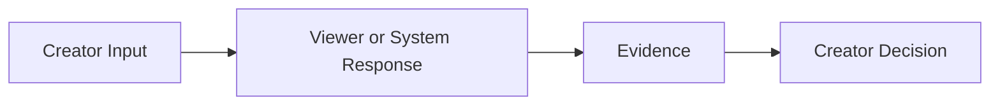

# Resource Title

Open in plain language. Explain the creator problem, why the subject matters, and what the reader will be able to do after reading.

> **Creator principle:** Put the single most useful mental model here.

---

## The Creator Mental Model

Explain the subject as simply as possible before introducing technical terminology.

### At a Glance

| Creator question | Plain-English answer | Why it matters |
|---|---|---|
| ... | ... | ... |
| ... | ... | ... |

### Simple Process Flow

---

## What This Means for Your Channel

Connect the subject to ordinary creator decisions.

Prefer questions such as:

- What should I look at?
- What might this pattern mean?
- What should I not assume?
- Which ViewTube tool should I open next?

> **Use this in ViewTube:** Give a concrete diagnostic or workflow handoff.

---

## Core Concepts

Introduce terminology only after the mental model is clear.

### Concept

Explain it in creator language first.

Then, if necessary, add the exact technical definition.

### Comparison

| Concept | What it measures/does | What it does not prove | Creator use |
|---|---|---|---|
| ... | ... | ... | ... |

---

## Diagnose Real Creator Questions

Organize analysis around questions, not a field inventory.

### Question

**Inspect:**

- metric/evidence;
- dimension/context;
- filter/scope;
- time window.

**Possible interpretations:**

- ...
- ...

**Do not conclude:**

- ...

**Open in ViewTube:**

- ...

---

## Creator Action Toolbox

### Before You Start

- [ ] Define the audience or goal.
- [ ] Write the question you are trying to answer.
- [ ] Choose a fair comparison.

### During Review

- [ ] Check context, source and time window.
- [ ] Separate evidence from inference.
- [ ] Compare like-for-like cases.

### After Action

- [ ] Record the hypothesis.
- [ ] Record what changed.
- [ ] Set a review window.
- [ ] Measure the result.

---

## Common Misinterpretations and Myths

### Myth / Misinterpretation

**Common conclusion:** ...

**What the evidence supports:** ...

**What else to check:** ...

---

## Use This in ViewTube

Create a practical handoff map.

| What you observe | ViewTube tool | Useful next question |
|---|---|---|
| ... | ... | ... |

Include an example Brain prompt when useful.

---

## Quick Reference

| Creator question | Best first evidence/action |
|---|---|
| ... | ... |
| ... | ... |

---

## Glossary

**Term** — Plain-English definition first. Add technical precision only where it helps the creator use the concept correctly.

---

## Advanced Reference

This section is optional for ordinary creators.

Move developer/API architecture, exact field names, backend schemas, historical model details, implementation caveats, and similar technical material here unless the reader genuinely needs it earlier.

Never let advanced reference become the primary learning path.

---

## Related ViewTube Resources

- Resource A
- Resource B

---

## Sources and Further Reading

### Current Official Creator Sources

**Source title** — What creator-facing claim it supports.  
https://example.com

### Official Technical / Reference Sources

**Source title** — What precise definition or technical constraint it supports.  
https://example.com

### Research / Historical Sources

Use only when useful, clearly dated, and not presented as an exact description of current proprietary systems.

---

## Document Maintenance

| Attribute | Value |
|---|---|
| Document version | 1.0 |
| Research completed | YYYY-MM-DD |
| Primary audience | Everyday YouTube creators |
| Technical depth | Creator-first with optional advanced reference |
| Review cadence | Semi-annual / quarterly / event-driven |

### Maintenance Checklist

- [ ] Recheck current official creator guidance.
- [ ] Recheck technical definitions that materially affect creators.
- [ ] Keep the primary reading path plain-language and action-oriented.
- [ ] Move developer-only implementation detail out of the main path.
- [ ] Update ViewTube tool handoffs.
- [ ] Preserve stable resource ID after publication.
